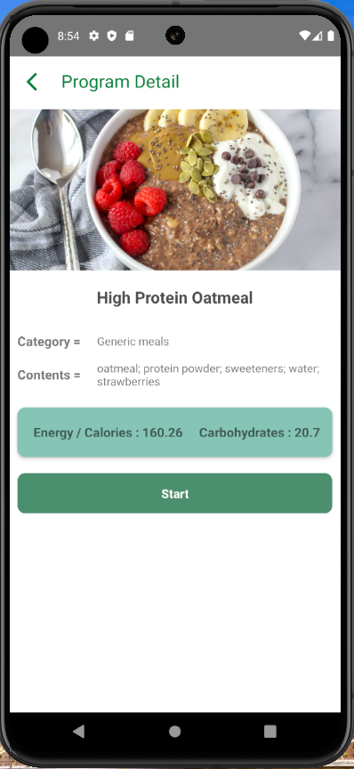
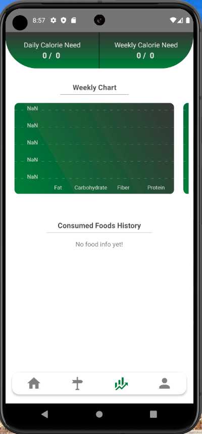

# React Native Patika Diet App

The project is a mobile application that calculates the body mass index, daily calorie needs, fat loss calorie, and recommended diet program according to the information entered by the user. The user can view the diet programs from the API, create their own diet program, view the saved foods on the calendar, view the daily and weekly calorie needs and the calories consumed, and see the total nutritional values of the foods consumed in weekly and monthly charts. In addition, the user can add a profile photo, see own information and update information such as age, height, and weight.


## Features
- Users can register and login.
- After logging in and enters some information, according to this information, body mass index, daily calorie needs, fat loss calorie and recommended diet program are calculated.
- The main page shows the diet programs from the API and the recommended diet program. In addition, user can search for food and create own diet program by clicking Create Diet Program. While creating own program, user can add time and meal information to the foods.
- User can view the saved foods on the calendar on the My Plan page and delete it if wishes.
- On the Results page, the user can view the daily and weekly calorie needs and the calories consumed.
- In addition, users can see the total nutritional values of the foods consumed in weekly and monthly charts.
- On the profile page, user can add a profile photo, see own information and update information such as age, height, and weight.


## Screenshots






## Installation

To run the Todo app on your local machine, you need to have Node.js and npm installed. You also need to have an Android or iOS emulator installed on your computer or a physical device connected to your computer. Follow these steps to install and run the application:

1. Clone the repository:

   ```bash
   git clone https://github.com/yusufie/react-native-patika-diet.git
    ```

2. Navigate to the project directory:

   ```bash
   cd react-native-patika-diet
   ```

3. Install the dependencies:

   ```bash
    npm install
    ```

4. Run the development server:

   ```bash
   npm run start
   ```

6. Run the application on an emulator or a physical device:

   ```bash
   npm run android
   ```

   or

   ```bash
   npm run ios
   ```

Open the emulator or connect your physical device to your computer to run the application. The application will be automatically installed and launched on the device.


## Packages

- react-native-community/checkbox
- react-native-firebase/app
- react-native-firebase/auth
- react-native-firebase/database
- react-navigation/bottom-tabs
- react-navigation/stack
- axios
- date-fns
- formik
- lodash
- react-native-calendars
- react-native-chart-kit
- react-native-collapsible
- react-native-config
- react-native-date-picker
- react-native-element-dropdown
- react-native-flash-message
- react-native-image-picker
- react-native-linear-gradient
- react-native-modal
- react-native-svg
- react-native-vector-icons


## Contributing

Contributions are welcome! If you find any issues or have suggestions for improvements, please open an issue or submit a pull request. Follow these steps to contribute:

1. Fork the repository.
2. Create a new branch for your feature or bug fix.
3. Make the necessary changes and commit those changes.
4. Push your code to your forked repository.
5. Submit a pull request describing the changes you made.

Please make sure to follow the existing code style and conventions.